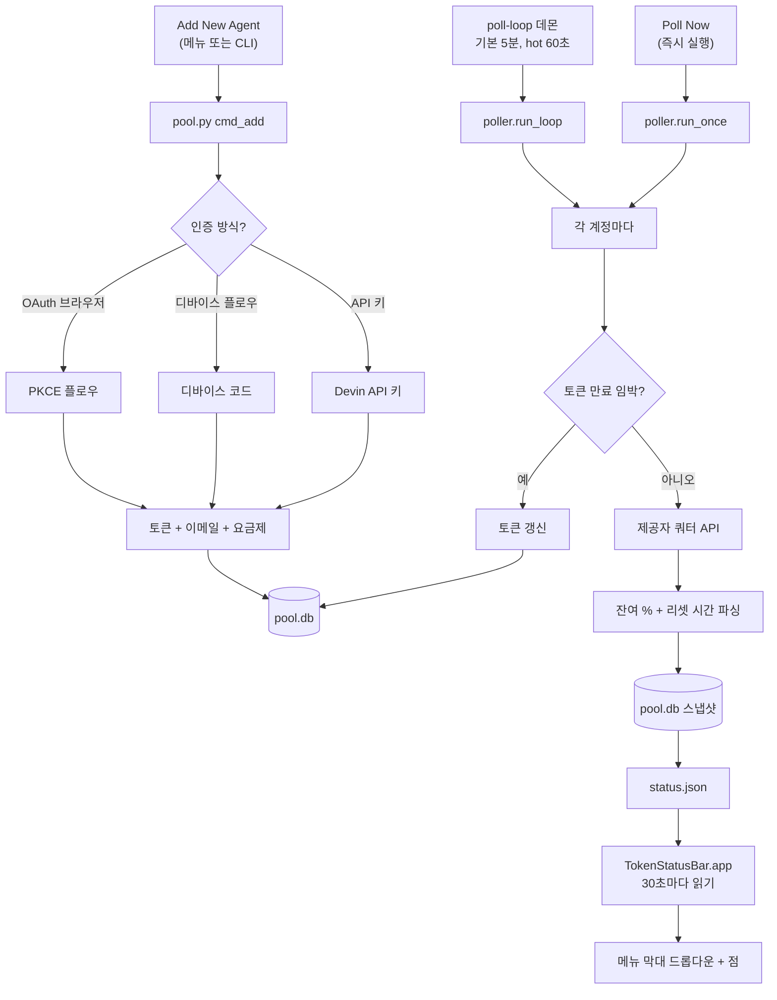
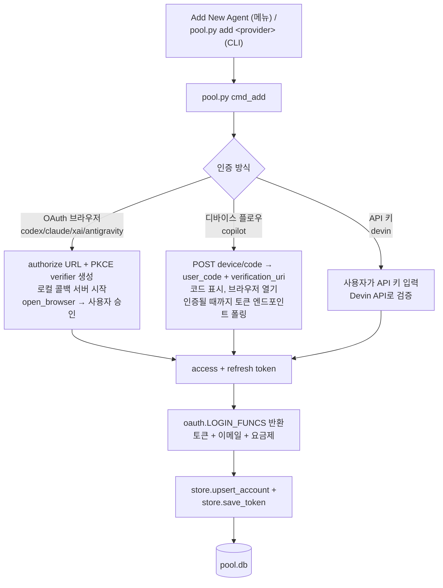
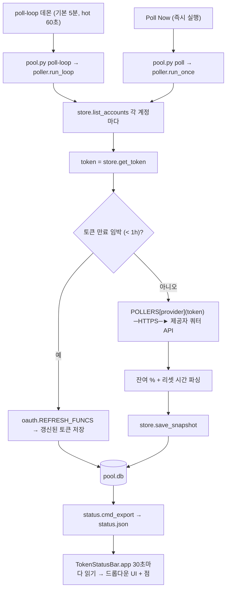

<p align="center">
  
</p>

<h1 align="center">Token Status Bar</h1>

<p align="center">
  <em>여러 AI 코딩 에이전트 계정의 실시간 토큰 / 쿼터 상태를 macOS 메뉴 막대 한 곳에서.</em>
</p>

<p align="center">
  
  
  
  
  <a href="./LICENSE"></a>
</p>

<p align="center">
  <sub><a href="./README.md">English</a> &middot; <a href="./README.ko.md">한국어</a></sub>
</p>

<p align="center">
  <a href="https://github.com/bytonylee/token-status-bar/releases/latest/download/TokenStatusBar.dmg"></a>
</p>

<p align="center">
  
</p>

---

> *토큰 상태 표시줄은 보유한 모든 AI 코딩 에이전트 계정 — OpenAI Codex, Anthropic
> Claude, xAI / Grok, Google Antigravity, GitHub Copilot, Devin — 의 실시간
> 토큰과 쿼터 상태를 하나의 macOS 메뉴 막대에서 보여줍니다. Python 백엔드가
> 각 제공자의 사용량 API를 폴링하고, 가벼운 Swift 메뉴 막대 앱이 이를
> 표시합니다.*

메뉴를 열면 제공자별로 묶인 초록 / 노랑 / 빨강 가용성 점을 볼 수 있고,
계정별 하위 메뉴로 들어가거나 **Poll Now**로 즉시 갱신할 수 있습니다.

> 여러 에이전트 계정을 함께 쓰면서, 어떤 계정에 아직 쿼터가 남았는지, 언제
> 리셋되는지, 어떤 토큰이 곧 만료하는지 한눈에 보고 싶은 사람을 위해
> 만들었습니다 — 대시보드를 따로 열 필요 없이.

**Python 백엔드는 각 제공자를 폴링해 `secrets/status.json`을 기록합니다 —
기본 5분 주기에, 사용량이 많은(hot) 계정은 60초, 로컬 세션 동기화는 약
15초의 적응형 주기입니다. Swift 앱은 이를 30초마다 읽습니다. 온보딩은
`Add New Agent` 메뉴 한 번으로 실행됩니다: 브라우저 OAuth 제공자는 바로
OAuth 플로우를 열고, GitHub Copilot은 디바이스 코드를 보여주기 위해
터미널을 열며, Devin은 앱 안의 프롬프트로 API 키를 입력받습니다. 진짜
API가 있으면 스크래핑하지 않습니다.**

## 기능

- 제공자별로 묶인 드롭다운 메뉴와 계정마다 초록 / 노랑 / 빨강 가용성 점 표시.
- 계정별 하위 메뉴에 요금제, 상태, 토큰 만료, 쿼터 윈도우 표시.
- 지원하는 모든 제공자의 실시간 쿼터 조회(API가 있는 경우 스크래핑하지 않음).
- 백그라운드 폴러(기본 5분 주기, hot 계정 60초, 로컬 동기화 약 15초)와 즉시 실행용 **Poll Now**.
- **Add New Agent** 한 번으로 온보딩 — 브라우저 OAuth는 백그라운드에서,
  Copilot 디바이스 코드 플로우는 터미널에서, Devin은 앱 내 API 키 입력으로 실행.

## 지원 제공자

| 제공자             | 키            | 인증 방식        |
|--------------------|---------------|------------------|
| OpenAI Codex       | `codex`       | OAuth (브라우저) |
| Anthropic Claude   | `claude`      | OAuth (브라우저) |
| xAI / Grok         | `xai`         | OAuth (브라우저) |
| Google Antigravity | `antigravity` | OAuth (브라우저) |
| GitHub Copilot     | `copilot`     | OAuth (디바이스 플로우) |
| Devin              | `devin`       | API 키           |

### 현재 상태 표시 범위

| 제공자 | 사용량 / 쿼터 상태 | 구독 기간 상태 |
|--------|--------------------|----------------|
| OpenAI Codex | 요금제, 5시간 / 주간 사용량, 리셋 크레딧 | 현재 인증된 `wham/usage` 응답에서 제공되지 않음 |
| Anthropic Claude | 요금제, 5시간 / 주간 사용량 | 구독 시작일만 제공(`subscription_created_at`) |
| xAI / Grok | 월간 크레딧, 일일 요청/토큰 제한 | billing API에서 시작일과 종료일 제공 |
| Google Antigravity | 티어와 모델 쿼터 | 현재 Code Assist 엔드포인트에서 제공되지 않음 |
| GitHub Copilot | 프리미엄/채팅 쿼터와 월간 리셋 | 리셋/종료일만 제공(`quota_reset_date`) |
| Devin | 일일/주간 쿼터와 크레딧 잔액 | `GetUserStatus`에서 시작일과 종료일 제공 |

## 동작 방식

두 개의 파이프라인이 있습니다. **온보딩**(OAuth로 계정 연결)은 토큰을
`pool.db`에 저장하고, **폴링**은 그 토큰으로 각 제공자의 쿼터 API를 호출해
앱이 표시할 `secrets/status.json`을 생성합니다.

### 흐름도



### 온보딩 — OAuth 연결



### 폴링 — 쿼터 정보 가져오기



## 요구 사항

- macOS 14 (Sonoma) 이상 — 앱의 `LSMinimumSystemVersion`은 14.0입니다.
- 앱 빌드를 위한 Xcode 커맨드라인 도구(`swiftc`).
- 폴링 백엔드용 Python 3.9 이상.

## 구성

| 경로                 | 용도 |
|----------------------|------|
| `app/TokenStatusBar.swift` | 단일 파일 Swift 메뉴 막대 UI. |
| `build.sh`           | `TokenStatusBar.app` 컴파일 및 번들링. |
| `backend/pool.py`    | CLI: 온보딩, 폴링, 상태 내보내기. |
| `backend/poller.py`  | 제공자별 실시간 쿼터 폴링. |
| `backend/status.py`  | 앱이 읽을 `status.json` 생성. |
| `backend/store.py`   | SQLite 저장소 (`pool.db`). |
| `backend/oauth.py`   | 제공자별 OAuth / 디바이스 플로우 로그인. |
| `secrets/status.json` | 메뉴 막대 앱이 사용하는 스냅샷 (git 무시). |
| `secrets/pool.db`    | SQLite 계정/쿼터 저장소 (git 무시). |

데이터는 기본적으로 `~/solo/token-status-bar/secrets/` 아래에 저장됩니다(`pool.db`,
`status.json`). `AGENT_POOL_DB`, `AGENT_POOL_STATUS_JSON` 환경 변수로 경로를
바꿀 수 있습니다.

## 앱 빌드 및 실행

```bash
./build.sh
open /Applications/TokenStatusBar.app
```

앱은 30초마다 `secrets/status.json`을 읽고 메뉴 막대에 차트 아이콘을 표시합니다.

## CLI 사용법

```bash
python3 backend/pool.py add <provider> [label]   # OAuth 온보딩 (codex|claude|xai|antigravity|copilot)
python3 backend/pool.py add-devin <api_key> [label]
python3 backend/pool.py list                     # 모든 계정 목록
python3 backend/pool.py remove <account_id>
python3 backend/pool.py status                   # 계정 + 최신 한도 상태
python3 backend/pool.py poll                     # 1회 폴링 (모든 API 호출)
python3 backend/pool.py poll-loop                # 폴러 데몬 실행 (기본 5분 주기)
python3 backend/pool.py refresh <account_id>     # 토큰 1개 갱신
python3 backend/pool.py refresh-all              # 만료 예정 토큰 전체 갱신
python3 backend/pool.py export-status            # status.json 작성
```

## 백그라운드 폴러 (launchd, 수동 설정)

이 저장소에는 launchd plist가 포함되어 있지 않습니다 — 백그라운드 폴러는
직접 설정해야 합니다. `secrets/status.json`을 최신 상태로 유지하려면
`~/Library/LaunchAgents/com.tonye.agentpool-poller.plist`를 직접 만들어
`ProgramArguments`에 `python3 <repo>/backend/pool.py poll-loop`를 지정하고
`RunAtLoad`/`KeepAlive`를 true로 설정한 뒤 로드하세요:

```bash
launchctl bootstrap "gui/$(id -u)" ~/Library/LaunchAgents/com.tonye.agentpool-poller.plist
```

`poller.py`를 수정한 뒤에는 새 코드를 반영하도록 데몬을 다시 시작하세요:

```bash
launchctl kickstart -k "gui/$(id -u)/com.tonye.agentpool-poller"
```

launchd 대신 아무 터미널 세션에서 `python3 backend/pool.py poll-loop`를
실행하거나, 메뉴의 **Poll Now**만 사용해도 됩니다.

## Poll Now vs Refresh Display

- **Poll Now** — 모든 제공자의 API를 직접 호출해 `pool.db`와 `status.json`을
  갱신한 뒤 다시 불러옵니다. 느리지만 최신 수치를 가져옵니다.
- **Refresh Display** — 디스크에 저장된 `status.json`만 다시 읽습니다.
  즉시 반영되며 네트워크를 사용하지 않습니다.

## 라이선스

[MIT](./LICENSE)
