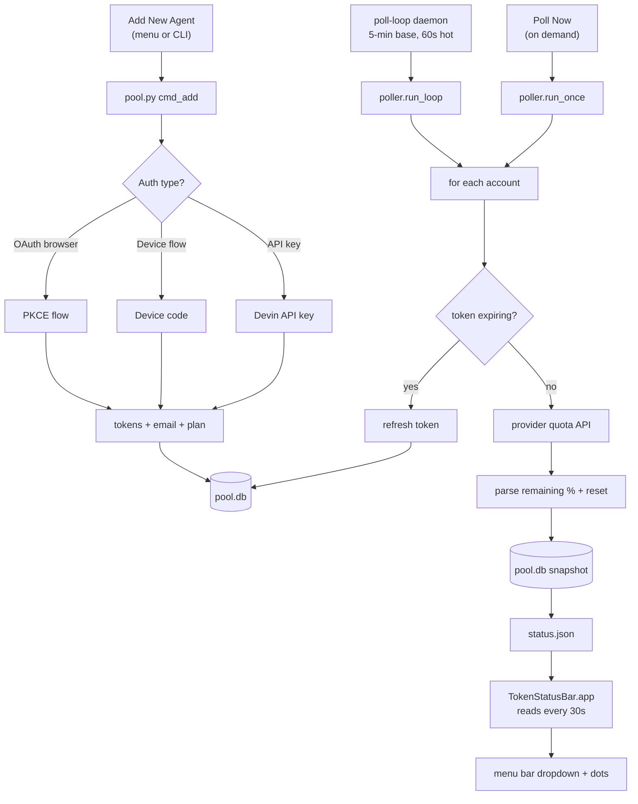
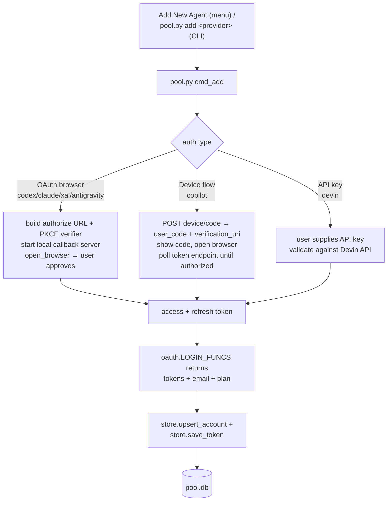
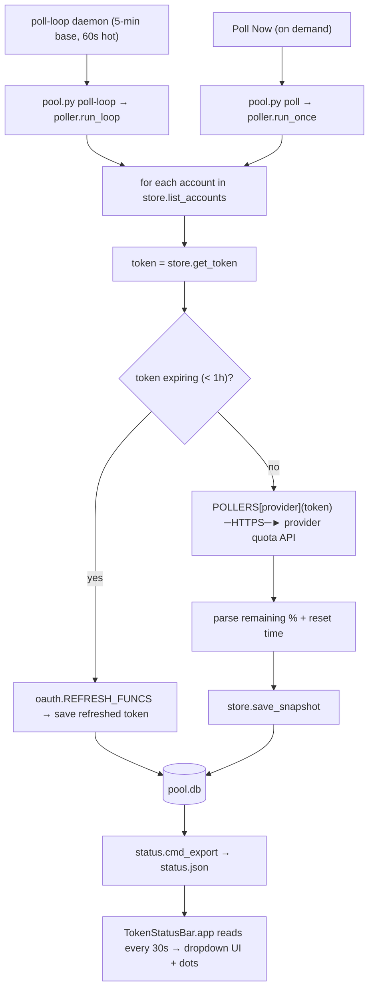

<p align="center">
  
</p>

<h1 align="center">TokenBar</h1>

<p align="center">
  <em>Token status for every AI user. Straight from your macOS menu bar.</em>
</p>

<p align="center">
  
  
  
  
  <a href="./LICENSE"></a>
</p>

<p align="center">
  <sub><a href="./README.md">English</a> &middot; <a href="./README.ko.md">한국어</a></sub>
</p>

<p align="center">
  <a href="https://github.com/bytonylee/token-status-bar/releases/latest/download/TokenStatusBar.dmg"></a>
</p>

<p align="center">
  
</p>

---

> *TokenBar manages every AI coding-agent account you own — OpenAI Codex,
> Anthropic Claude, xAI / Grok, Google Antigravity, GitHub Copilot, and Devin
> — from a single macOS menu bar. Every poll classifies each account's exact
> subscription (paid / free / expired / renews-soon) and quota (ok / warning /
> exhausted) state, rolls stale windows forward the moment they reset, and can
> automatically swap credentials to a fresh account when the active one runs
> dry — so you're never caught mid-work with a dead token.*

Click the menu to see providers grouped with a green / yellow / red
availability dot per account, drill into a per-account submenu, or hit
**Poll Now** for a fresh fetch.

> Built for people juggling several agent accounts who want to know at a glance
> which one still has quota, which is about to reset, and which token is about
> to expire — without opening a dashboard.

**The Python backend polls each provider and writes `secrets/status.json` —
adaptive cadence: 5-minute base, 60-second polling for hot accounts, and a
~15-second local session sync; the Swift app reads it every 30 seconds.
Onboarding is a one-click `Add New Agent` menu item: browser-OAuth providers
launch the OAuth flow directly, GitHub Copilot opens Terminal to show its
device code, and Devin asks for its API key in an in-app prompt. No scraping
where a real API exists.**

## Features

- Menu-bar dropdown grouped by provider, with a green / yellow / red availability
  dot per account.
- Per-account submenu with plan, status, token expiry, and quota windows.
- Real-time quota for every supported provider (no scraping where an API exists).
- Background poller (5-minute base interval, 60-second hot polling, ~15-second
  local sync) plus on-demand **Poll Now**.
- One-click **Add New Agent** onboarding — browser OAuth in the background,
  Copilot's device-code flow in Terminal, Devin via an in-app API-key prompt.
- Exact subscription and quota state every poll — stale windows roll forward
  the moment they reset, so the dot never lies.
- Zero-touch account swap — when the active Codex account exhausts its
  quota, TokenBar automatically swaps in a usable same-provider account
  (guardrails: cooldown, no swap on stale data or mid-session, notified
  every time).
- Full lifecycle audit trail — every reset, paid/expired transition, and
  swap is recorded and queryable.

## Supported providers

| Provider          | Key           | Auth          |
|-------------------|---------------|---------------|
| OpenAI Codex      | `codex`       | OAuth (browser) |
| Anthropic Claude  | `claude`      | OAuth (browser) |
| xAI / Grok        | `xai`         | OAuth (browser) |
| Google Antigravity| `antigravity` | OAuth (browser) |
| GitHub Copilot    | `copilot`     | OAuth (device flow) |
| Devin             | `devin`       | API key       |

### Current status coverage

| Provider | Usage / quota status | Subscription period status |
|----------|----------------------|----------------------------|
| OpenAI Codex | Plan, 5h / weekly usage, reset credits | Not exposed by the current authenticated `wham/usage` response |
| Anthropic Claude | Plan, 5h / weekly usage | Subscription start only (`subscription_created_at`) |
| xAI / Grok | Monthly credits, daily request/token limits | Start and end exposed by the billing API |
| Google Antigravity | Tier and model quota | Not exposed by the current Code Assist endpoints |
| GitHub Copilot | Premium/chat quota and monthly reset | Reset/end only (`quota_reset_date`) |
| Devin | Daily/weekly quota and credit balance | Start and end exposed by `GetUserStatus` |

## How it works

Two pipelines: **onboarding** (connect an account over OAuth) writes tokens to
`pool.db`; **polling** reads those tokens, calls each provider's quota API, and
writes `secrets/status.json` for the app to render.

### Flow



### Onboarding — connecting OAuth



### Polling — getting the quota info



## Requirements

- macOS 14 (Sonoma) or later — the app targets `LSMinimumSystemVersion` 14.0.
- Xcode command-line tools (`swiftc`) to build the app.
- Python 3.9+ for the polling backend.

## Layout

| Path                 | Purpose |
|----------------------|---------|
| `app/TokenStatusBar.swift` | Single-file Swift menu-bar UI. |
| `build.sh`           | Compiles and bundles `TokenStatusBar.app`. |
| `backend/pool.py`    | CLI: onboarding, polling, status export. |
| `backend/poller.py`  | Per-provider real-time quota polling. |
| `backend/status.py`  | Writes `status.json` for the app to read. |
| `backend/store.py`   | SQLite storage (`pool.db`). |
| `backend/oauth.py`   | OAuth / device-flow login per provider. |
| `secrets/status.json` | Snapshot consumed by the menu-bar app (git-ignored). |
| `secrets/pool.db`    | SQLite account/quota store (git-ignored). |

Data lives under `~/solo/token-status-bar/secrets/` by default (`pool.db`,
`status.json`). Override with the `AGENT_POOL_DB` and `AGENT_POOL_STATUS_JSON`
environment variables.

## Build & run the app

```bash
./build.sh
open /Applications/TokenStatusBar.app
```

The app reads `secrets/status.json` every 30 seconds and shows a chart icon in
the menu bar.

## CLI usage

```bash
python3 backend/pool.py add <provider> [label]   # onboard via OAuth (codex|claude|xai|antigravity|copilot)
python3 backend/pool.py add-devin <api_key> [label]
python3 backend/pool.py list                     # list all accounts
python3 backend/pool.py remove <account_id>
python3 backend/pool.py status                   # accounts + latest limit status
python3 backend/pool.py poll                     # one poll cycle (hits all APIs)
python3 backend/pool.py poll-loop                # run the poller daemon (5-min base interval)
python3 backend/pool.py refresh <account_id>     # refresh one token
python3 backend/pool.py refresh-all              # refresh all expiring tokens
python3 backend/pool.py export-status            # write status.json
```

## Background poller (launchd, manual setup)

No launchd plist ships with this repo — the background poller is a manual
setup. To keep `secrets/status.json` fresh, create
`~/Library/LaunchAgents/com.tonye.agentpool-poller.plist` yourself with a
`ProgramArguments` entry that runs `python3 <repo>/backend/pool.py poll-loop`
and `RunAtLoad`/`KeepAlive` set to true, then load it:

```bash
launchctl bootstrap "gui/$(id -u)" ~/Library/LaunchAgents/com.tonye.agentpool-poller.plist
```

After editing `poller.py`, restart the daemon so it loads the new code:

```bash
launchctl kickstart -k "gui/$(id -u)/com.tonye.agentpool-poller"
```

Alternatively, skip launchd and run `python3 backend/pool.py poll-loop` in any
terminal session (or rely on the menu's **Poll Now**).

## Poll Now vs Refresh Display

- **Poll Now** — actively calls every provider's API, updates `pool.db` and
  `status.json`, then reloads. Slower; fetches fresh numbers.
- **Refresh Display** — only re-reads the cached `status.json` from disk.
  Instant; no network.

## License

[MIT](./LICENSE)
